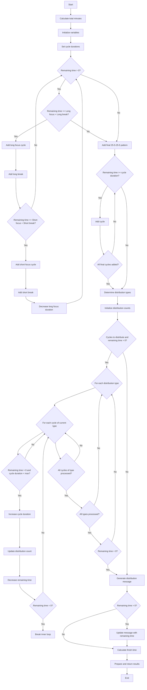

Focus Timer ( multi user timer ) has a public root landing page before login. The landing page does not use the shared app header; account entry points are the hero login/signup CTAs.

## Development

```bash
uv sync
uv run python manage.py migrate
uv run python manage.py runserver
```

## Docker

```bash
cp .env.sample .env
docker compose up --build
```

Production runs the same Compose stack on OpenShip. See
[`docs/operations.md`](docs/operations.md) for deployment, health checks, and
SQLite backup/restore guidance.

Algorithm i used to calculate time intervals for sessions using camel technique. this camel style focus intervals is used by twitch streamer https://www.twitch.tv/vanyastudytogether/


