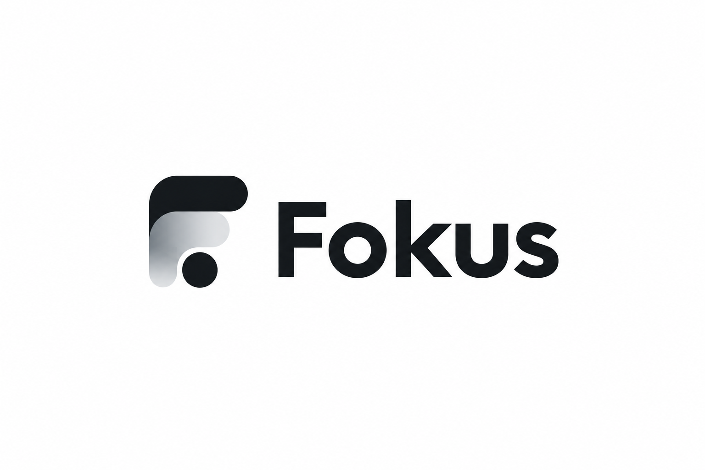

<p align="center"></p>

A co-focus shared timer: you build a session from a focus technique, share
the room link, and everyone watches the same authoritative server-side
countdown together. Anyone with the link joins with just a display name,
and rooms stay isolated to their own participants and timer.

This is the hosted backend plus a Vue 3 SPA (`web/`), designed to be the
same surface that future Android and Windows native apps will use.

## Why the rewrite

The old stack was Django + Channels + Daphne + Redis + a Redis zset
scheduler worker + nginx, six cooperating services to tick a countdown.
Chrome throttled background-tab timers and the `hack_timer.js` web-worker
hack only partially worked, so the old timers drifted and the server made
expensive aggregation queries to answer "how much time is left". Now one
Bun process serves API, websockets, and the SPA.

## The core idea: never tick

A countdown must not be accumulated by anything, in the browser or on the
server. Time is a pure function of the wall clock:

```
remaining_ms = duration_ms
             - elapsed_ms                    # consumed before the last start
             - (running ? now - clock_started_at : 0)
```

Consequences:

- The server stores timestamps, never accumulated ticks. Cycle transitions
  are lazy (any read advances the session) plus a 1-second in-process
  sweeper for rooms nobody is watching. Overshoot past a boundary is
  inherited by the next cycle, so a single read catches up correctly.
- The client renders `remaining - (Date.now() - serverNow)` and resyncs on
  visibility change. A frozen or throttled tab loses nothing; the math is
  already correct when it wakes. No web worker, no WASM.
- Focus totals are exact by construction: a completed FOCUS cycle has its
  full duration, a stopped one has its partial `elapsed_ms`.

## Stack

One language (TypeScript), one runtime (Bun), one process:

- **Bun** serves HTTP API + native WebSockets via **Hono**.
- **bun:sqlite** (SQLite, WAL) is the only datastore.
- **Vue 3 + Vite** in `web/` (Bun workspaces), served by the same process.
- Passwordless identity: creating a session or opening a room link mints
  an anonymous user and sets a signed HttpOnly cookie. No accounts, no
  passwords, no email. Session creators are owners; everyone else joins
  with a display name, and the dashboard counts owned and joined sessions.

Deps: `hono`, `vue`, `vue-router`, `vite`. Dev deps: `@types/bun`,
`@biomejs/biome`, `@vitejs/plugin-vue`. Nothing else.

## What was kept from the old codebase

- All focus techniques, ported **verbatim**: Camel (greedy long-focus
  packing, the reserved final 25-5-25-5 block, the three distributors),
  Pomodoro, 52/17, 90-minute, 2-hour blocks, Flowtime, Custom.
  `test/fixtures/techniques-golden.json` was generated from the old Python
  implementation and the port must match it exactly.
- The limits: cycles 1..600 minutes, at most 250 per session, total time at
  most 17h59.
- `assets/` brand binaries (favicons, logo, og image).

## What was cut, and add back when

- **Accounts, passwords, emails**. Identity is the cookie. If you lose it,
  you lose your stats; that is fine for a free co-focus timer.
- **Per-participant focus logs** (the old FocusPeriod rows each follower
  tracked during someone else's session). Add a periods table back when a
  real participant asks for it.
- **Redis, channels, scheduler, nginx, docker**. One process, one ox-engine
  deploy.
- **Client sync throttling**. Reads are O(1); nothing to throttle.

## Web UI

- **Builder**: the technique preview regenerates on every input change;
  no submit button.
- **Room**: an SVG circle progress ring renders the timer, with a
  share/copy-link button.
- **Dashboard**: lists sessions you own and sessions you joined.

## API

Timestamps are epoch milliseconds. Technique durations are minutes on the
wire.

### Identity

| Route | Body | Notes |
| --- | --- | --- |
| `POST /api/sessions` | `{technique, cycles:[{type, minutes}, ...]}` | starts running; also mints the identity if no cookie yet |
| `GET /api/me` | | stats + your recent sessions (zeros when no cookie) |

Cookie: `fokus_session`, HttpOnly, SameSite=Lax, Secure, 30 days,
HMAC-signed. Losing it means an anonymous identity is minted again.

### Techniques

`POST /api/techniques/preview` (no auth needed):

```json
{"technique":"Camel","totalMinutes":180,
 "distributeLong":false,"distributeShort":false,"distributeLast":false}
```

Response:

```json
{"technique":"Camel","totalMinutes":180,"remainingMinutes":0,
 "cycles":[{"type":"FOCUS","minutes":50},{"type":"BREAK","minutes":10}, ...]}
```

### Sessions

| Route | Body | Notes |
| --- | --- | --- |
| `POST /api/sessions` | `{technique, cycles:[...]}` | starts running |
| `GET /api/sessions/:id` | | state view (+ `isOwner`); also mints the identity if no cookie yet |
| `POST /api/sessions/:id/toggle` | | owner; updated state view |
| `POST /api/sessions/:id/stop` | | owner; partial focus stays |
| `POST /api/sessions/:id/next` | | owner; skips to next cycle |

### WebSocket

`GET /ws/session/:id` (cookie or anonymous). Server messages:

- `timer_update` on connect (includes `isOwner`), on every mutation, and
  every cycle change (same view as the REST session route, plus `type`).
- `followers_update` `{"type":"followers_update","followers":[{"username":..,"joinedAtMs":..}]}`
- `error` `{"type":"error","message":"..."}`

Client messages (JSON):

- `{"action":"join_session","guest_name":"Sam"}`, a name is required for
  everyone (guests and cookie users)
- `{"action":"toggle_timer"}` / `{"action":"stop_timer"}` /
  `{"action":"transition_to_next_cycle"}` (owner only)
- `{"action":"sync_inactive_timer"}` (replies with `timer_update` to this
  socket)

`GET /healthz` returns `{"ok":true}`. Anything else not under `/api` or
`/ws` serves the SPA from `web/dist`.

## Data model

```sql
users(id, handle unique, created_at)                      -- anonymous identities
sessions(id text pk, owner_id, technique, state,          -- running|paused|completed
         current_cycle_order, cycle_clock_started_at?, created_at, completed_at?)
cycles(session_id, cycle_order, type, duration_ms, elapsed_ms, completed)
followers(session_id, username, user_id?, joined_at, pk(session_id, username))  -- live presence
memberships(session_id, user_id, joined_at, pk(session_id, user_id))            -- durable attribution
```

`cycles.elapsed_ms` banks a cycle's consumed time; a completed cycle holds
its full `duration_ms`. `sessions.cycle_clock_started_at` marks the last
start (null while paused). Isolation: a `followers` row is always scoped to
its session, and the room is the session. `followers` is the live
participant list (rows leave when their socket closes); `memberships` is
written once per joined user, so a joined session stays in the joiner's
dashboard after they leave.

## Development

```bash
cp .env.sample .env          # set SESSION_SECRET once
bun install                  # installs server and web (Bun workspaces)
bun run dev                  # API+WS+SPA on :8010
bun run dev:web              # or: vite dev server with API proxy
bun run build:web            # build the SPA into web/dist (the server serves it)
bun test                     # 373 tests: parity, engine, API, WS, isolation, client clock
bun run lint                 # biome
```

## Deployment

Self-hosted OpenShip, ox1 engine (`ox.toml`). Build runs
`bun install --frozen` and builds the SPA into `web/dist`. The process is a
plain `bun src/index.ts` command; SQLite lives at `./data/db.sqlite3`.
Needed env vars: `SESSION_SECRET` (required), `PORT`, `DATABASE_PATH`.
See `docs/operations.md`. No Docker anywhere.

## Roadmap

1. Android app: native timer UI using the same REST + WS surface.
2. Windows desktop app: same.
3. Add per-participant stats (periods table) only if real participants ask.
